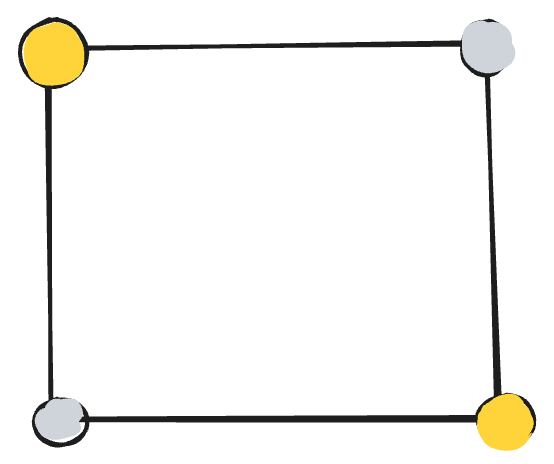
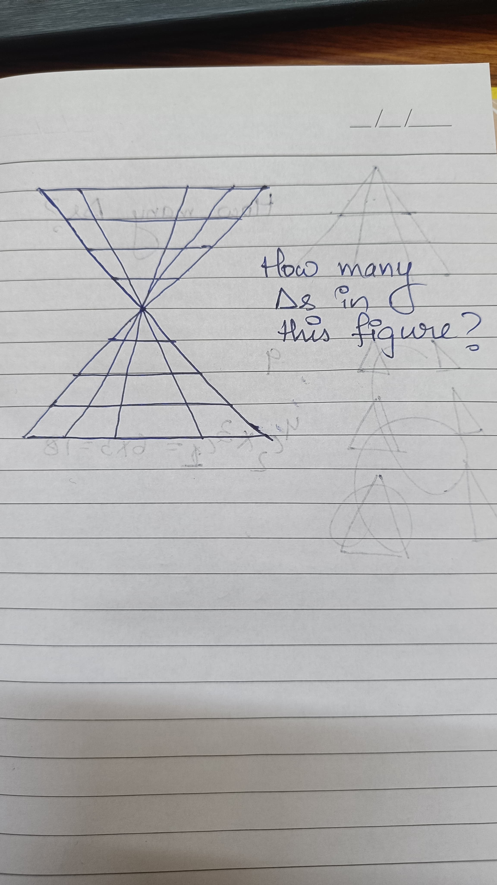
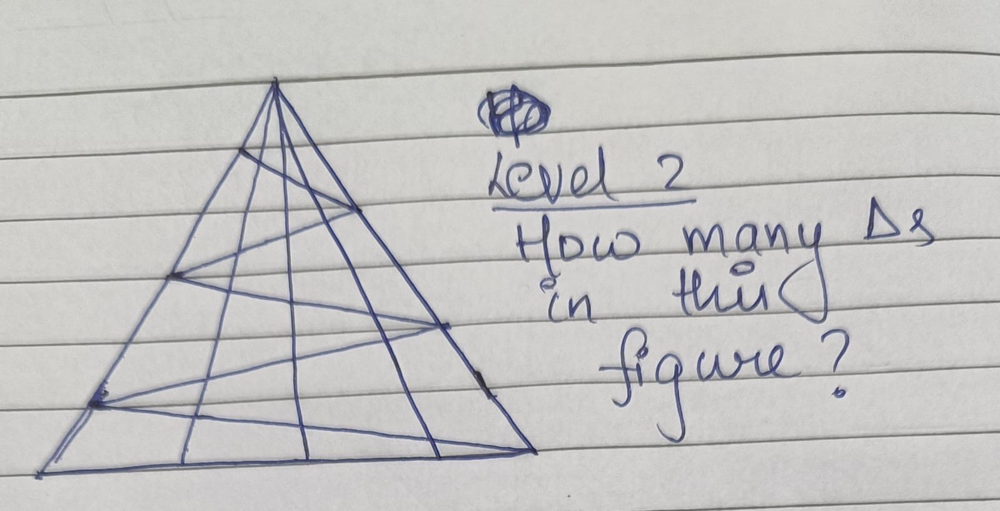
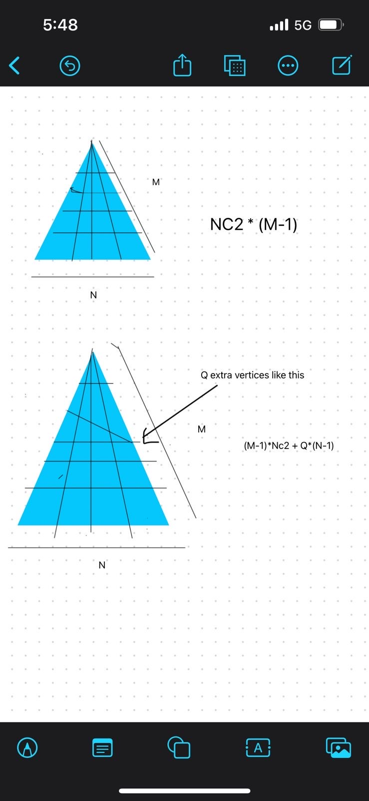
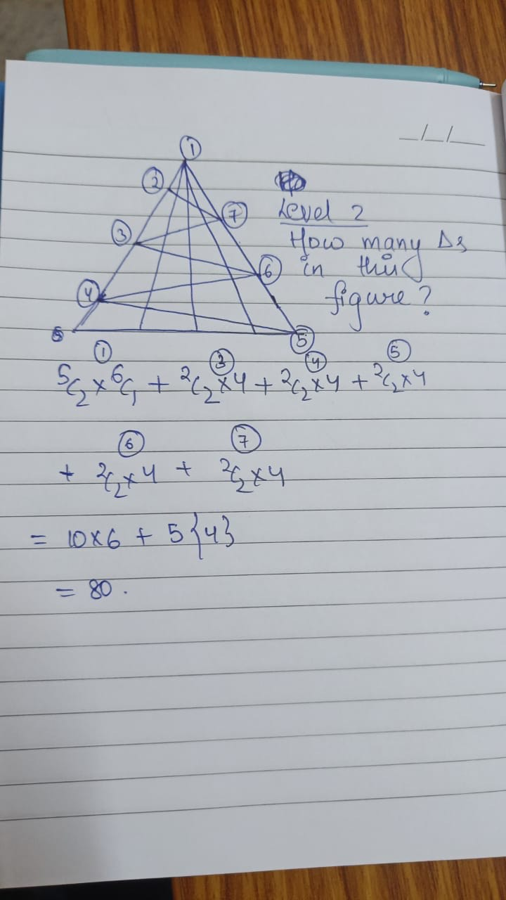

## Random Puzzles and Brain-Teasers

This repository contains (or is supposed to contain) a collection of intriguing puzzles and brain-teasers spanning various domains, including mathematics, machine learning, and competitive programming.


**Contributing:**
Feel free to add more new problems by opening a PR

---

<details>
<summary>
<strong>100 doors</strong>
<br/>
You are in a corridor with 100 doors, all of which are initially closed. You make 100 passes through the corridor. During each pass, you toggle the state (open/close) of the doors as follows:

On the 1st pass, you toggle every door (i.e., you open all doors since they were initially closed).
On the 2nd pass, you toggle every 2nd door (i.e., doors 2, 4, 6, ...).
On the 3rd pass, you toggle every 3rd door (i.e., doors 3, 6, 9, ...).
This process continues for 100 passes, with the 

_i-th_ pass toggling every  _i-th_ door.
At the end of the 100th pass, determine:

How many doors are open?
Which doors are open.

Bonus : solve it for any number of doors n.</summary>

**Answer:**

### Checkpoint 1:
- Each door is toggled when the pass number _i_ is a divisor of the door number.

### Checkpoint 2:
- A door's state will ultimately change **if it is toggled an odd number of times**.

### Checkpoint 3:
- Doors with **odd divisors** remain open.

---

### Idea:
- Only **perfect squares** have an odd number of divisors.
  - Example: 
    - 16: Divisors = \(1, 2, 4, 8, 16\) → Odd number of divisors.
    - 12: Divisors = \(1, 2, 3, 4, 6, 12\) → Even number of divisors.

---

### Final Result:
- Open doors = All perfect squares ≤ \(n\).
  - For \(n = 100\): Open doors = \(1, 4, 9, 16, 25, 36, 49, 64, 81, 100\).
  - i.e, they will be toggled odd number of times so they become open

### Ans:
The integer just less than $\sqrt{n}$

### First correct ans:
@aditigarg 💥

</details>

---

<details>
<summary><strong>Demon's table</strong>

You are in a room controlled by a demon mathematician. The square table has 4 buttons at the corners, which can either be on or off independently (you don't know which buttons are on or off). For escaping out of the room, you must have all buttons turned on. The doors immediately open when this state is reached. This is how you proceed:

 - In each step you can toggle the state of any subset of buttons simultaneously
 - After that, the demon can rotate the table by any multiple of 90 degrees (may be 0 degree also)

In how many steps can u say with guarantee that you can escape out of the room?

</summary>

**Answer:**

[Video Solution](https://www.youtube.com/watch?v=kTJbgRh5CnU&ab_channel=RanYeheskel)

</details>

---

<details>
<summary><strong>Random sequence</strong>

Find the next number in the sequence:

`2, 2, 8, 62, 622, ?`</summary>

**Answer:**


1^0-(-1),2^1-0,3^2-1,4^3-2,5^4-3,6^5-4

*Answer by yashvardhan jain*

</details>

---

<details>
<summary><strong>Not a log function</strong>

Let $f$ be a function defined on the set of rational numbers with the property that $f(a*b) = f(a) + f(b)$.

Additionally, $f(p) = p$ for all primes $p$.

For which of the values of $x$, is $f(x) < 0$ ?

  - $17/32$
  - $11/16$
  - $7/9$
  - $7/6$
  - $25/11$</summary>

**Answer:**

1. f(p*1) = f(p)+f(1) 
=> f(1) = 0

2. f(1) = f(x) + f(1/x) = 0
=> f(x) = -f(1/x)

3. f(p1*p2) = f(p1)+ f(p2) = p1 + p2

now, it should be easy to solve for each.
for example, 
f(17/32) = f(17)- f(32) = 17 - (2+2+2+2+2) = 1

ans is (e)

</details>

---

<details>
<summary><strong>Jump game - 23</strong>

Premise:

Let `G` be an infinitely large square grid. A point (a,b) on `G` is one which is `a` units horizontal and `b` units vertical from the starting vertex (0,0). A jump `J(x)` is defined such that on performing the jump, you move from (a,
b) to (a+x/b, b+x/a) where `x` is a real positive number.

Question:

If you somehow are at (1,2) currently, can u move to the position (2,3) after performing finite number of jumps `J`?
If yes, what is the minimum number of such jumps?</summary>

**Answer:**

## Answer
We can never reach (2,3)

## Solution

Usually, when you want to compute f(f(f(....f(something)))), its a good idea to see whats `invariant` in successive iterations.

For our question -> 
f(a,b) turns into f(a+x/b, b+x/a)

basically, f(a,b) -> f((ax+b)/b, (ax+b)/a)

so the ratio of arguments are same `(a/b)`

so we will only reach to such coordinates such that `x/y = 1/2`

Hence, we will never reach 2/3

### First correct ans:
@yashvardhanjain 💥

</details>

---

<details>
<summary><strong>Die Hard</strong>

MS Dhoni rolls three fair standard six-sided dice. Then he looks at all the rolls and chooses a subset of the dice (possibly empty, possibly all three) to reroll. After rerolling, he wins if and only if the sum of the numbers face up on the three dice is exactly `7`. MSD always plays to optimize his chances of winning. What is the probability that he chooses to reroll exactly 2 of the dice?

  - $7/36$
  - $5/24$
  - $2/9$
  - $17/72$
  - $1/4$</summary>

**Answer:**

*Answer not available*

</details>

---

<details>
<summary>
<strong>Number Sequence</strong>
<br/>
1, 1, 2, 1, 2, 2, 3, 1, 2, 2, 3, ...</summary>

**Answer:**

Pattern: _number of set bits in the binary representation of numbers 1...n_

</details>

---

<details>
<summary>
<strong>Waiting for the U-turn</strong>
<br/>
This concerns the waiting effort involved in pulling of a U-turn when the car arrivals from the opposite time are at random epochs.
Let us assume the following: to pull off a U-turn, the driver requires τ time units (this is fixed and known as per the driver's caliber) of contiguous no arrivals of cars from the opposite direction.
The car arrival process is a random process in the following manner: starting from time 0 (when the driver arrives at the turn), the first car arrives at a random time T_1, the next cars arrives random time T_2 after the first car arrived, then T_3 and so.. 
These "inter-arrivials" times can be assumed to be independent and identically distributed and follow the exponential distirbution with parameter λ>0 which is fixed and known. 
Find the expected waiting time before the U-turn.</summary>

**Answer:**

*Answer not provided in the repository*

</details>

---

<details>
<summary>
<strong>Hedge Fund Trader</strong>
<br/>
If you're a hedge fund trader and you have 2 options.
1) toss a coin once and either win $1000 on heads or lose $1000 on tails
2) toss a coin 1000 times and win $1 on heads or lose $1 on tails each time.</summary>

**Answer:**

Option 2) it minimises standard deviation i.e. risk


fact: depressed trader tends to be a gambler


</details>

---

<details>
<summary>
<strong>Noodle Strands</strong>
<br/>
You are blindfolded and given a bowl of 100 noodle strands. You randomly pick two end points of strands and join them. That is, if they were belonging to the same strand they would form a ring and otherwise they would form a larger strand.</summary>

**Answer:**

1/199 + 1/197 +1/195 + ……+ 1

*First answer: yashvardhan jain 🔥*

</details>

---

<details>
<summary>
<strong>Three Switches</strong>
<br/>
You are in the downstairs lobby of a house. There are three switches, all in the
"off" position. Upstairs, there is a room with a lightbulb that is turned off. One and
only one of the three switches controls the bulb. You want to discover which switch
controls the bulb, but you are only allowed to go upstairs once. How do you do it?
(No fancy strings, telescopes, etc. allowed. You cannot see the upstairs room from
downstairs. The lightbulb is a standard 100-watt bulb)</summary>

**Answer:**

Switch the first one on for 10 minutes. Switch it off. Switch the other on and go up and check. If it's hot and off, it's the first switch it's on, its the second one, if neither, it's the third.

*First answer: pritvik premkumar 🔥*

</details>

---

<details>
<summary>
<strong>Fair Die Roll</strong>
<br/>
A fair six sided die is rolled untill an odd number appears.
Whats the probability that all evens (2,4,6) all appear?</summary>

**Answer:**

1/20

*First answer: yashvardhan jain 🔥*

</details>

---

<details>
<summary>
<strong>Counterfeit Coins</strong>
<br/>
There are 5 bags of 5 identical coins each. 4 out of 5 bags has all coins weighing 10gm each. One bag has coins weighing 9gm each. Using a weighing machine identify the counterfeit bag in a single attempt.</summary>

**Answer:**

Place 1 coin from 1st bag, 2 from 2nd and so on ..the weight you get will be a 10x + 9y form..this way we can identify the bag

*First answer: vanshika agarwal 🔥*

</details>

---

<details>
<summary>
<strong>Sherlock and Watson</strong>
<br/>
Sherlock and Watson are sitting together. Watson is blind. He has a red colored and an identical blue colored ball but does not know their colors. Sherlock claims that he is not blind. Watson can ask at most 7 questions to Sherlock. Devise a strategy of questions through which Watson can verify whether Sherlock is blind with more than 99% accuracy.
Btw this is actually a primer problem for zero knowledge proofs in blockchain systems. :)</summary>

**Answer:**

The 7 ques are "did i swap?"

</details>

---

<details>
<summary>
<strong>Random Fraction</strong>
<br/>
Take two positive random numbers x and y in the interval [0,1] and compute x/y.
What is the probability that this fraction rounded off to the nearest integer is an even number ?</summary>

**Answer:**

1/4 +sum(n=0 to inf)[ 1/(3+4n)-1/(5+4n)]

*First answer: yashvardhan jain 🔥*

</details>

---

<details>
<summary>
<strong>Die Roll Until 4</strong>
<br/>
I roll a fair six sided die untill a 4 appears. What is the expected value of the largest number i see?</summary>

**Answer:**

1/3*4+ 1/2*6 + 1/6*5
we have to figure out permutations of 4,5,6

*First answer: yashvardhan jain 🔥*

</details>

---

<details>
<summary>
<strong>Class Number Game</strong>
<br/>
You're in a class of 100+ students. All have to pick a number between 1 and 100 inclusive. Then we take the mean of all chosen numbers. The winner is the one whose choice is closest to 2/3rd of the mean.

What number would you choose and why.</summary>


**Detailed Explanation:**

This was the exact premise of one of the games in the show Alice in Borderlands.

**Theoretical Analysis:**
1? Without the condition, the mean would be 50. Two thirds would mean 33ish. However, since everyone knows it would be 33, everyone would choose it. Taking the mean to 22. So everyone would choose 22, reducing the mean further and further, until everyone wins at 1.

**Realistic Considerations:**
100+ in a class is important for two reasons here:
1) there will be a mixture of people, some of who would not play rationally
2) you can't communicate or plan with everyone 

Majority will be smart. That can be assumed


**Answer:**

The idea should be to take some realistic percentage of different kind of people.
Lets say 10% is very smart so they pick 1. 20% can be random so i would pick 37 as the mean for them as its the most (gaussian) common number in random selection. And rest i can pick 30 or 40 as mean who only thought through first step. This way.
You can say that 8-20 is a good range.
Actually a game theory proff in Yale uni did this experiment in his class and his results were like this: (not exact) 22, 25, 13, 9, etc. 
so we can see the weighted scoring holds up to some extent
</details>

---


<details>
<summary><strong>Count triangles</strong>

<strong>Level:1</strong>


<strong>Level:2</strong>
</summary>

**Answer:**

## Solution:

There are multiple ways to count this. One is something 
@divyanshjain learnt during his prep for NTSE, to directly come to a general formulae to find number of triangles formed:

Basically for a given base, if there are _n_ lines emerging from it, the number of trianges are nc2.
This number when multiplied by the number of unique bases, gives the total answer.



Again there are multiple ways to count this, and you don't have to remember any formulae. Below is the solution provided by @adityaagarwal



Another way of counting this as done by @somyajeet and @aryan is
```
(4c2*1 + 4c1*2)*5 + 5c2
```
(Proof is left as an exercise for the reader)

## Answer

`80` for both level-1 and level-2

</details>

---
<details>
<summary>
Let P(x) be a polynomial with integer coefficients that satisfies P(17) = 10 and P(24) = 17.
Given that P(n) = n+3 has two distinct integer solutions n1 and n2, find the product of n1 and n2.</summary>

**Yashvardhan's Answer ( Wrong ):**
asically Q(x)= P(x)-n-3
and T(x)= Q(x)+10
and T(x) roots are 17,24
so the value of the constant is 408 in T(x), so the value of constant in Q(x) should be 408-10


</details>

